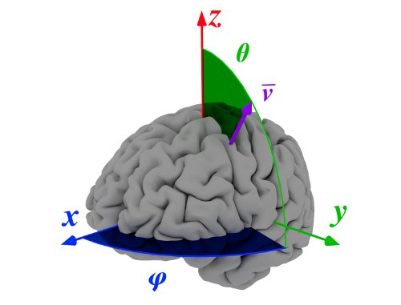
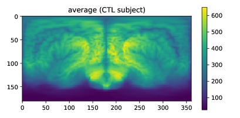

Quickstart on mapBrain
===========================
`mapBrain` is a library used to perform the **Spherical Brain Mapping** on neuroimaging. 

Spherical Brain Mapping
--------------------------------
The **Spherical Brain Mapping** (SBM) is a feature extraction and visualization framework intended to map the internal structures and features of the brain onto a 2D image that summarizes all this information.  

SBM allows three-to-two dimension mapping by means of some statistical measures. The system is based on a conversion from 3D spherical to 2D rectangular coordinates. For each spherical coordinate pair :math:`(\theta,\varphi)`, a vector :math:`\mathbf{v}_{(\theta,\varphi)}` oriented in that direction and starting at the defined origin (usually the *Anterior Commisure*), is defined. This vector creates a set of voxels :math:`V_{(\theta,\varphi)}` that contains the intensities of all voxels crossed by :math:`\mathbf{v}_{(\theta,\varphi)}`. 

From :math:`V_{(\theta,\varphi)}`, a number of **SBM measures** can be computed, including including statistical values (average, entropy, kurtosis) and morphological values (tissue thickness, distance to the central point, number of non-zero blocks). These values conform a two-dimensional image that can be computationally and visually analysed.

Installation
-------------------
`mapBrain` is now available via `pypi` and can be installed directly from::

	pip install mapBrain

Alternatively, download the package, uncompress and execute::

	cd /path/to/uncompressed/mapBrain/
	python setup.py install

Quick usage
------------------------
`mapBrain` transforms 3D brain images in 2D maps showing texture and statistical information. To use it, import the `SphericalBrainMapping` class as:: 

	import mapBrain.SphericalBrainMapping as sbm

Imaging information must be in `numpy.ndarray` format, so you can load the images using, e.g., nibabel as::

	import nibabel as nib
	image = nib.load('/path/to/neuroimaging.nii')

Once the image has been load, extract the relevant information as::

	imarray = image.get_data()
	affine = image.affine

If no *origin* is specified, mapBrain directly uses the geometrical center of the image. To specify the *Anterior Commisure* as origin, work with the image **affine** and extract this position on the array::

	posAC = image.affine[:,3]/affine.diagonal()

The position may vary depending on the registration procedure used. To quickly generate and visualize a SBM measure of an image, do::

	aux = sbm.doSBM(imarray, origin=-posAC, measure='average', show=True)

That should output a window (if not, use plt.show() of matplotlib.pyplot) with an average map just like this: 

